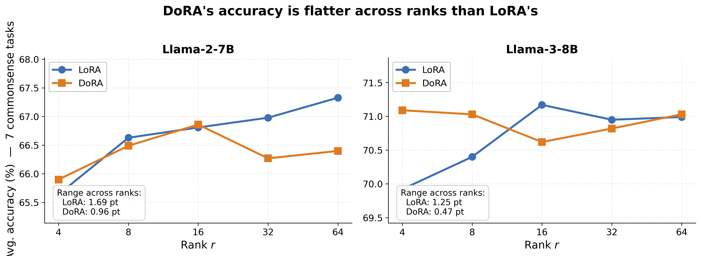

# dora-repro

PyTorch re-implementation of **DoRA: Weight-Decomposed Low-Rank Adaptation**. This repository compares standard LoRA with DoRA-style weight decomposition on Llama-family causal language models trained and evaluated on commonsense reasoning tasks.

## Introduction

The chosen paper is *DoRA: Weight-Decomposed Low-Rank Adaptation*, which argues that parameter-efficient fine-tuning improves when a pretrained weight update is decomposed into separate magnitude and direction components instead of only applying a low-rank additive update as in LoRA.

This repo re-implements the core DoRA idea for selected linear projections in Llama models, runs LoRA and DoRA baselines, and records evaluation logs and plots for a small reproduction of the paper's commonsense reasoning result.

## Chosen Result

The target result is the paper's commonsense reasoning comparison between LoRA and DoRA, corresponding to the paper's main empirical claim that DoRA can improve parameter-efficient fine-tuning (PEFT) quality at similar trainable-parameter budgets. In our reproduction, the closest comparison is the rank sweep over LoRA and DoRA adapters on seven commonsense benchmarks.



We focus on the paper's commonsense QA setting rather than every modality and task in the original work. The reproduction asks whether DoRA gives more stable or better average accuracy than LoRA across ranks on `BoolQ`, `PIQA`, `HellaSwag`, `WinoGrande`, `ARC-e`, `ARC-c`, and `OpenBookQA`.

## GitHub Contents

| Path | Contents |
| --- | --- |
| `code/` | Training, evaluation, plotting, DoRA layer implementation, and adapter loading scripts. |
| `data/` | Evaluation JSON files under `data/test-set/`; full fine-tuning data should be placed at `data/ft-training-set/commonsense_170k.json`. |
| `results/`, `results/results_v2/` | Saved `lm-eval` output logs from LoRA, DoRA, and BiDoRA runs. `results_v2/` is the source for the final rank plots. |
| `figures/` | Generated PNG/PDF plots used for the poster and README. |
| `adapters/` | Saved adapter-only checkpoints plus `adapters/README.md` with loading/evaluation instructions. |
| `FouDoRA/` | Experimental Fourier/DoRA code kept separate from the main reproduction path. |
| `run_smoke_test.sh` | Short end-to-end sanity check for LoRA and DoRA. |
| `run_experiments.sh` | Longer scripted sweep over selected LoRA and DoRA configurations. |
| `dora_pipeline.ipynb` | Notebook version of the project workflow. |
| `poster/CS4782_poster.pdf` | In-class project poster PDF. |
| `LICENSE` | MIT license for the repository code. |
| `report/` | Contains the LaTeX and PDF for the final 2 page report summarizing this project |

## Re-implementation Details

The main experiments use `meta-llama/Llama-2-7b-hf` and `meta-llama/Meta-Llama-3-8B`, loaded with `torch.bfloat16`, `device_map="auto"`, and SDPA attention. The LoRA baseline uses PEFT with rank `r`, `lora_alpha = 2r`, no bias, and target modules `q_proj` and `v_proj`; the DoRA path freezes the base model and wraps the same projections with the custom DoRA implementation in `code/dora.py`.

Fine-tuning uses the commonsense instruction dataset expected at `data/ft-training-set/commonsense_170k.json`, tokenized to length 512 with causal language-model labels. Training defaults are batch size 4, gradient accumulation 4, learning rate `2e-4`, cosine schedule, 50 warmup steps, 1,000 max steps unless overridden, and bf16 training.

Evaluation uses EleutherAI `lm-eval` through `code/evaluate.py` on:

```text
boolq, piqa, hellaswag, winogrande, arc_easy, arc_challenge, openbookqa
```

The repo also includes `bidora`, an experimental variant that alternates magnitude and direction updates for faster and more stable training. This is not part of the core paper reproduction and should be treated as an extension.

## Reproduction Steps

1. Clone the repository and install dependencies:

```bash
pip install -r requirements.txt
```

If running outside Colab, install the correct PyTorch build for your CUDA/CPU environment before or alongside the requirements. The project was primarily run in a Colab style environment.

2. Get access to the gated Llama base models on Hugging Face, then authenticate:

```bash
huggingface-cli login
```

You need access to any base model used with `--model_id`, such as `meta-llama/Llama-2-7b-hf` or `meta-llama/Meta-Llama-3-8B`.

3. Add the fine-tuning data:

```text
data/ft-training-set/commonsense_170k.json
```

The checked-in evaluation files are under `data/test-set/`, but the full fine-tuning file is not redistributed here. Place the Commonsense 170K instruction file at the path above before training; `run_smoke_test.sh` fails fast if it is missing.

4. Run a short smoke test:

```bash
chmod +x run_smoke_test.sh
./run_smoke_test.sh
```

This runs 5 training steps for LoRA and DoRA at rank 2, then evaluates 10 BoolQ examples. On an A100-class Colab GPU this should take roughly 5-10 minutes, mostly due to model loading.

5. Train one adapter:

```bash
python code/train.py \
  --method dora \
  --rank 16 \
  --model_id "meta-llama/Llama-2-7b-hf" \
  --max_steps 1000
```

Available methods are `lora`, `dora`, and `bidora`. For BiDoRA, optional controls include `--bidora_phase_steps` and `--bidora_start_with direction|magnitude`.

6. Evaluate a merged model:

```bash
python code/evaluate.py \
  --model_path /content/temp_models/Llama-2-7b-hf_dora_r16_final
```

Evaluation logs are written to `results/<model_name>_eval.txt`. To run fewer tasks or examples, use `--tasks` and `--limit`, for example:

```bash
python code/evaluate.py \
  --model_path /content/temp_models/Llama-2-7b-hf_dora_r16_final \
  --tasks boolq \
  --limit 10
```

7. Run the longer experiment script:

```bash
chmod +x run_experiments.sh
./run_experiments.sh
```

The training script currently saves merged checkpoints under `/content/temp_models/`, matching the Colab workflow used for the project. On a local machine, either create that path or edit `save_dir` in `code/train.py`.

8. Rebuild or evaluate saved adapters:

```bash
python code/load_dora_adapter.py \
  --adapter_source <hf_user>/<repo_name-or-local-adapter-path> \
  --output_dir /content/temp_models/restored_dora \
  --merge
```

See `adapters/README.md` for LoRA/DoRA adapter loading details and common gotchas.

9. Regenerate figures:

```bash
python code/make_plots.py
```

This writes `figures/rank_curves.{png,pdf}`, `figures/pertask_r4_llama3.{png,pdf}`, and `figures/poster_figure.{png,pdf}`.

## Results / Insights

The reproduced rank sweep shows that DoRA is competitive with LoRA on the seven-task commonsense average, with the clearest DoRA gain appearing for Llama-3-8B at very low rank.

| Model | Rank | LoRA avg. acc. | DoRA avg. acc. | Difference |
| --- | ---: | ---: | ---: | ---: |
| Llama-2-7B | 4 | 65.64 | 65.90 | +0.26 |
| Llama-2-7B | 16 | 66.81 | 66.86 | +0.05 |
| Llama-2-7B | 64 | 67.33 | 66.40 | -0.93 |
| Llama-3-8B | 4 | 69.92 | 71.09 | +1.17 |
| Llama-3-8B | 16 | 71.17 | 70.62 | -0.55 |
| Llama-3-8B | 64 | 70.99 | 71.03 | +0.04 |

At rank 4 on Llama-3-8B, DoRA improved the average most strongly and helped on harder benchmarks such as `WinoGrande`, `ARC-e`, and `ARC-c`, while `OpenBookQA` was slightly lower. Running this repo should produce merged fine-tuned models under `/content/temp_models/`, evaluation logs under `results/`, and the plots under `figures/`.

## Conclusion

This reproduction supports the paper's broader claim that decomposing weight updates into magnitude and direction can be a useful PEFT modification, especially in low-rank settings. The results are not uniformly better than LoRA at every rank, but DoRA remains competitive and sometimes improves accuracy without changing the base model.

The main practical lessons were that gated model access, data placement, and adapter serialization are as important as the DoRA math for reproducible experiments.

## References

- Liu et al. *DoRA: Weight-Decomposed Low-Rank Adaptation*. arXiv:2402.09353, 2024.
- Hu et al. *LoRA: Low-Rank Adaptation of Large Language Models*. arXiv:2106.09685, 2021.
- Gao et al. *A Framework for Few-shot Language Model Evaluation* (`lm-evaluation-harness`).
- Qin et al. *BiDoRA: Bi-level Optimization-Based Weight-Decomposed Low-Rank Adaptation*. arXiv:2410.09758, 2024.
- Hugging Face `transformers`, `peft`, `datasets`, and `trl` libraries.

## Acknowledgements

This project was completed for CS 4782 by Eli Furgeson, Eric Do, and Levi Kronenthaler. We also acknowledge the authors of DoRA, LoRA, BiDoRA, the Hugging Face ecosystem, and the maintainers of `lm-eval` for making this reproduction possible.
